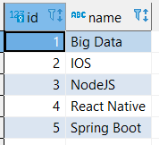
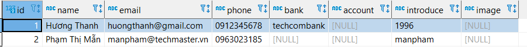
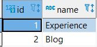
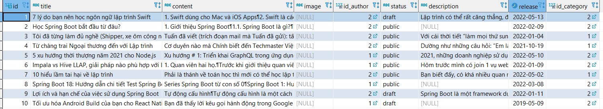
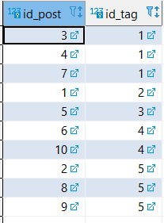

### Insert bảng tag
```sql
INSERT INTO `category` (`id`, `name`) VALUES (1, 'Big Data'), (2, 'IOS'), (3, 'NodeJS'), (4, 'React Native'), (5, 'Spring Boot');
```




### Insert Bảng 'author'
### 'id' = 1
```sql
INSERT INTO `author` (`id`, `name`, `email`, `phone`, `bank`, `account`, `introduce`, `image`) VALUES (NULL, 'Hương Thanh', 'huongthanh@gmail.com', '0912345678', 'techcombank', NULL, '1996');
```

### 'id' = 2
```sql
INSERT INTO `author` (`id`, `name`, `email`, `phone`, `bank`, `account`, `introduce`, `image`) VALUES (NULL, 'Phạm Thị Mẫn', 'manpham@techmaster.vn', '0963023185', NULL, NULL, 'manpham', NULL); 
```



### Insert bảng category
```sql
INSERT INTO `category` (`id`, `name`) VALUES (NULL, 'Experience'), (NULL, 'Blog');
```



### Insert bảng post
```sql
INSERT INTO `post` (`id`, `title`, `content`, `image`, `id_author`, `status`, `description`, `release_date`, `id_category`) VALUES (NULL, '7 lý do bạn nên học ngôn ngữ lập trình Swift', '1. Swift dùng cho Mac và iOS Apps\r\n2. Swift là cách tuyệt vời để phát triển nhanh chóng\r\n3. Swift có tốc độ thực thi nhanh\r\n4. Swift an toàn và bảo mật hơn\r\n5. Swift là miễn phí và mã nguồn mở\r\n6. Swift đang lớn lên và nhu cầu nhân sự các nhà lập trình Swift ngày càng cao\r\n7. Swift là tương lai của Apple', NULL, '2', 'draft', 'Lập trình có thể rất căng thẳng, đặc biệt nếu bạn cố gắng bắt đầu với một ngôn ngữ lập trình cổ. Với người mới học tốt hơn nên tiếp cận vào một thứ gì đó hiện đại hơn, chẳng hạn như Python, Ruby hoặc Swift. Tuy nhiên, những cựu chiến binh viết mã cũng có nhiều lợi ích khi chuyển sang ngôn ngữ lập trình Swift, kể cả những người cảm thấy bị “đốt cháy” bởi các ngôn ngữ chính cống.', '2022-05-13', '2'), (NULL, 'Học Spring Boot bắt đầu từ đâu?', '1. Giới thiệu Spring Boot\r\n1.1. Spring Boot là gì?\r\nSpring là một Java framework siêu to và khổng lồ, làm được đủ mọi thứ. Nó được chia thành nhiều module, mỗi module làm một chức năng, ví dụ Spring Core, Web, Data access, AOP,… Spring được xây dựng dựa trên 2 khái niệm nền tảng là Dependency injection và AOP (Aspect Oriented Programming).\r\n\r\n1.2. Tại sao nên học Spring Boot?\r\nTrước đây mình đã có tìm hiểu về Node.js và chuyển sang Spring Boot. Cảm nhận của mình là khi code Spring Boot chúng ta sẽ tập trung nhiều hơn vào business logic, nghĩa là mục tiêu của code làm được gì.\r\n\r\nVới Node.js, do nó quá linh hoạt nên bạn sẽ phải tập trung nhiều vào code hơn, thay vì mục đích của code. Kiểu như bạn phải tìm “best practice”, “cách tốt nhất” để code điều gì đó.\r\n\r\nNhưng với Spring boot thì khác, có nhiều thư viện có sẵn và cấu trúc code cũng thành chuẩn mực rồi, nên bạn không cần quá quan tâm phải viết code thế nào cho tốt nữa, thay vào đó sẽ tập trung vào logic hơn.\r\n2. Cần tìm hiểu những gì\r\n2.1. Java Core\r\nTrước khi học Spring Boot thì các bạn cần biết Java. Một số kiến thức cần thiết của Java như sau:\r\n\r\nJava cơ bản: biến, hàm, vòng lặp,…\r\nHướng đối tượng (OOP)\r\nJava 8: các tính năng mới trong java 8 (tối thiểu phải biết)\r\nCollections API: biết cách dùng các collection thông dụng (quan trọng)\r\nNgoài ra các bạn có thể tìm hiểu thêm (không biết cũng không sao vì Spring Boot khá ít đụng tới):\r\n\r\nStream API\r\nAsynchronous\r\nMulti threading\r\nFile IO\r\n2.2. Package manager\r\nKhi code dự án Spring Boot thì cần có package manager để quản lý các thư viện cài thêm. Bạn nào code Javascript sẽ biết về NPM và Yarn, thì Java cũng có hai package manager tương tự là Maven và Gradle.\r\n\r\nTìm hiểu cách dùng Maven cơ bản\r\nTìm hiểu cách dùng Gradle cơ bản\r\nPhần này khi mới bắt đầu không nên tìm hiểu quá sâu, chỉ cần biết cách cài đặt thư viện, xóa thư viện, chỉnh sửa thông tin project, các build-in tasks là được. Sau này khi đụng tới nhiều thì bạn tự khắc quen thôi.\r\n\r\n2.3. Spring Boot\r\nCách học Spring Boot đúng đắn là học thực hành, làm project. Bởi vì nhiều thứ trong Spring Boot rất dễ, hoặc thành chuẩn mực rồi, chủ yếu là bạn đã từng đụng tới chưa thôi (sẽ có thêm các bài viết cụ thể theo các chủ đề sau):\r\n\r\nHọc Spring Boot bắt đầu từ đâu: Bài giới thiệu lộ trình học hôm nay.\r\nTạo dự án Spring Boot đầu tiên: Dùng Spring Initializr để generate code, chọn các dependency, chạy, debug, build JAR và chạy file JAR đó.\r\nLuồng đi trong Spring Boot: Tìm hiểu một service Spring Boot gồm những thành phần nào, và luồng đi của dữ liệu ra sao.\r\nDependency injection áp dụng vào Spring Boot như thế nào (phần 1)\r\nDependency injection áp dụng vào Spring Boot như thế nào (phần 2)\r\nBean và ApplicationContext là gì trong Spring Boot: Tìm hiểu cơ bản về Bean và ApplicationContext.\r\nVòng đời, các loại bean và cơ chế component scan: Tìm hiểu sâu hơn về cách các bean được định nghĩa và xử lý.\r\nCấu trúc một dự án Spring Boot thế nào cho chuẩn: Tìm hiểu các thành phần cơ bản như Controller, Services,… và cách tổ chức chúng trong source code.\r\nEntity, DTO và Model: Ba đối tượng chứa dữ liệu chính và cách convert, mapping qua lại giữa chúng.\r\nSpring Boot xử lý request trong controller như thế nào (phần 1): Cách controller hoạt động, các loại HTTP method và nhận dữ liệu từ request.\r\nSpring Boot xử lý request trong controller như thế nào (phần 2)\r\nXử lý request trong Controller (phần 2): Trả về lỗi và xử lý chuyên dụng với các loại data đặc biệt.\r\nXử lý exception phát sinh trong ứng dụng Spring Boot\r\nValidation dữ liệu request - luôn luôn cần thiết\r\nTổ chức code service trong Spring Boot: bài ngắn gọn nói sơ qua về vai trò của service layer.\r\nXử lý exception hiệu quả trong Spring Boot: Cách tạo Aspect để bắt exception dù nó ném ra ở bất cứ đâu.\r\nCấu hình Spring Boot trong file application.properties: đó là gì và kĩ thuật chia cấu hình hiệu quả.\r\nHTML template và static content: Thư mục template và static là gì, có chức năng như thế nào?\r\nScheduled job trong Spring Boot: Tạo và thực hiện tác vụ theo lịch trình đặt sẵn.\r\nLập trình hướng khía cạnh AOP không khó như bạn nghĩ: Tìm hiểu về AOP, các khái niệm liên quan và thực hiện một demo logging cơ bản.\r\n2.4. JPA/MongoDB\r\nMình chỉ mới làm quen với Spring Boot được 6 tháng, và project mình làm chỉ về MongoDB thôi. Còn về SQL thì mình sẽ làm sau nhé 😃\r\n\r\nCách cấu hình database trong Spring Boot: Tạo DB, thêm các thông số kết nối và kết nối.\r\nCấu trúc lớp và interface của JPA: JPA/MongoDB gồm những interface, class nào, phân cấp ra sau và chức năng của chúng.\r\nCRUD cơ bản: Tìm hiểu các thao tác cơ bản CRUD.\r\nQuery creation: Tự động sinh câu query dựa trên tên method, hoặc bạn có thể custom nó bằng @Query.\r\nThực hiện các câu query phức tạp bằng MongoTemplate: Sử dụng MongoTemplate và các đối tượng như Query, Update,… để thực hiện các hành động phức tạp hơn với query.\r\nSắp xếp và phân trang data query được: Sort và paging dữ liệu query, đặc biệt là custom paging bằng skip và limit.\r\nThực hiện aggregation: Tổng hợp dữ liệu trong MongoDB\r\n2.5. Template engine\r\nTemplate engine xử lý phần View trong ứng dụng MVC, trong Spring Boot thì chúng ta sử dụng template engine để pass dữ liệu vào View và trả về một trang HTML.\r\n\r\nTrả về trang HTML cơ bản trong Spring Boot\r\nSử dụng Thymeleaf trong Spring Boot\r\nSử dụng JSP trong Spring Boot\r\n2.6. Các tool khác\r\nNgoài ra, trong dự án Spring Boot sẽ cần một số tool khác được embed vào code. Và bạn cần biết cấu hình và sử dụng chúng để nâng cao năng suất code.\r\n\r\nCấu hình và sử dụng Swagger trong Spring Boot: Swagger là một tool dùng để xem, chạy, test các API tương tự Postman. Đặc biệt là nó được kèm theo trong chính project của bạn, nó sẽ tự động phân tích metadata của code và sinh API. Ngoài ra Swagger còn có thể generate document từ code của bạn.\r\nThiết lập Logger cho project Spring Boot\r\nLombok - viết code Java ngắn hơn\r\nCấu hình Spring Actuator: Công cụ giám sát, theo dõi tình trạng web service Spring Boot. Actuator sẽ thêm 1 số API để bạn dùng, ví dụ /info hoặc /health để check tình trạng hoạt động của project.\r\nQuarzt - giải pháp thay thế cho Spring Schedule\r\nCấu hình Firebase trong Spring Boot: Sử dụng các tính năng của Firebase như Authentication, Firestore, Storage,… trong dự án Spring Boot.\r\nCấu hình Spring Boot devtools: Để có được các tính năng như HotReload.\r\n2.7. Nâng cao\r\nUnit testing: Sử dụng JUnit để test ứng dụng Spring Boot.\r\nXuất file Excel trong Spring Boot: Sử dụng Apache POI để tạo và xuất file Excel.\r\nCách thêm SSL cho Spring Boot: Làm cho API của bạn hỗ trợ HTTPS\r\nCách gửi mail trong Spring Boot\r\nCách cấu hình trang 404 và white page\r\n2.8. What’s next?\r\nSau khi đã nắm được đủ các kiến thức trên, các bạn có thể tìm hiểu thêm một số thứ khác liên quan Spring Boot.\r\n\r\nTìm hiểu Spring Security cơ bản\r\nXác thực người dùng trong Spring Security bằng session\r\nXác thực người dùng trong Spring Security bằng JWT\r\nSpring batch là gì?\r\nSpring reactive web: Web framework bất đồng bộ tương tự Node.js nhưng là Java.', NULL, '2', 'public', NULL, '2022-02-09', '2'), (NULL, 'Tôi đã từng làm đủ nghề (Shipper, xe ôm công nghệ, thợ giấy,..) và giờ đây là Lập trình viên Java!', 'Tuấn đã viết (trích đoạn mail mà Tuấn đã gửi): tất nhiên là tôi có biên tập lại chút chút cho câu văn nó mượt hơn xíu.\r\n\r\n\"Hi Ms. Pham Man,\r\n\r\nMình là Trương Văn Tuấn - năm nay mình 25 tuổi, mình đến từ Hà Tĩnh. Mình là cựu học viên khóa học Java Spring Boot Backend tại Techmaster Vietnam. Hiện mình đang làm việc tại công ty CMC Global vị trí Java Developer - Web Backend. Việc tham gia vào ngành công nghiệp phần mềm đối với mình là một niềm mơ ước, một bước tiến lớn trong cuộc đời của mình. Các đây khoảng năm 5 năm khi đang là sinh viên ngành Cơ khí tại trường Bách Khoa (Đúng kiểu anh cơ khí Bách Khoa sinh năm 96 luôn này) mình biết đến Thầy Cường và có theo dõi trên facbook, chính xác là thông qua các bài viết trên Blog của techmaster.vn mà mình vô tình đọc được. \r\n\r\nHọc xong Đại học mình có khoảng thời gian dài làm việc tự do mà không theo ngành cơ khí, mình chạy xe ôm công nghệ, ship hàng, làm thợ giấy dán tường. Giai đoạn làm thợ giấy, mình có xây dựng một website bán giấy dán tường bằng Joomla lấy tên là ecowall.vn, site vận hành mượt, có khách gọi nhưng mình không có vốn duy trì nên đành phải dừng lại. \r\n\r\nTiếp đến giai đoạn làm giao hàng, thấy người ta bán hàng hay quá mình thấy khá hứng thú nên cũng phát triển dở dang một website bằng Magento lấy tên homevalues.vn. Lúc này mình bắt đầu gặp khó khăn trong quá trình làm web vì không có chuyên môn, không như lần trước, lần này Magento phức tạp hơn và khó hơn nhiều. Mình đành phải tạm dừng và làm các công việc khác để duy trì cuộc sống.\r\n\r\nTôi vẫn làm các công việc để trang trải mọi chi phí, nhưng thấy cực quá, suốt ngày phơi mình khắp các nẻo đường nên mình quyết định đi học Lập trình như mong ước từ bao lâu, lúc đó mình có rủ thêm 2 bạn nữa đến trung tâm của thầy Cường đăng ký học, mình học Java web, 2 bạn kia học iOS mobile. Hiện một bạn đang làm lập trình viên mobile bên FPT F-Soft, bạn nữa theo nghề kỹ thuật hóa học như đã học ở trường.\r\n\r\nChia sẻ 1 chút về quá trình học khi tôi bắt đầu tại TechMaster: Trung tâm luôn cập nhật phương pháp, nội dung giảng dạy phù hợp với nhu cầu thị trường và thay đổi công nghệ mới nhất. Bên cạnh giờ học trên lớp, thực hành và bài tập về nhà sau mỗi buổi học, vẫn có các hoạt động giáo dục đan xen như Hackathon, thi giải thuật Algo Contest đem lại nhiều hiệu quả học tập, giúp học viên giao lưu gắn kết trong suốt quá trình học tại trung tâm cũng như sau nay đi làm. Mình ấn tượng với việc trung tâm khuyến khích học viên viết blog, dịch các bài viết công nghệ để chia sẻ kiến thức hay cho mọi người. Qua đó mình học được nhiều kiến thức và cải thiện tiếng Anh rất nhiều, hiện mình vẫn sẽ duy trì cách học này tại https://truongvantuan.github.io/#posts. Một pattern nữa mình áp dụng lúc học là code thực tế ngay các kiến thức vừa học để hiểu và thấy nó luôn, dù kiến thức đó có thể nhỏ hoặc đơn giản. Một điều nữa là phải thực hành chăm, mình nhận ra nó hơi muộn lúc còn học ở trung tâm. Mình biết mấy điều này sẽ được đọc bởi các bạn học khóa sau (nên mình đưa ra và khuyên các bạn hãy chăm thật chăm). Và mình đúc kết lại cho chính mình và mạn phép khuyên các bạn là phải “NGOAN”, hãy lắng nghe lời các thầy cô ở trung tâm, rồi sau này đi làm nữa, cũng phải “NGOAN” trong những năm tháng mới bước vào nghề nữa. Không gì quan trọng bằng những người Thầy sẵn sàng dạy mình khi mình đang là những “mầm non mới nhú với ngành lập trình”.\r\n\r\nHọc xong ở TechMaster mình có ngay việc làm, mình và gia đình vui lắm. Và nữa, mình có hành trang để đi tiếp, thầy cô ở trung tâm dặn phải giữ thói quen học suốt đời. Và mình luôn tin điều đó là đúng đắn.\r\n\r\nLời cuối mình xin chúc các bạn học viên hoàn thành khóa học thật tốt, xong xin được việc làm nhé. Chúc tất cả các thầy cô, các anh chị tại trung tâm TechMaster Việt Nam sức khỏe, luôn tìm được niềm vui trong việc giáo dục.\r\n\r\nAll the best,\r\n\r\nTruong Van Tuan\"\r\n\r\nCảm ơn những chia sẻ của Tuấn, TechMaster rất vui vì điều đó. Chúc Tuấn nhiều sức khỏe và sẽ gặt hái được nhiều thành công hơn nữa nhé!\r\n\r\nĐấy nhé, những ai mà cứ còn băn khoăn là trái ngành liệu có học được Lập trình, tay ngang sang lập trình khi chưa biết gì, rồi thì học xong liệu có đi làm được không? Hay là lộ trình của Trung tâm có đủ để đi làm được chưa? Thì hẳn đi đến đây rồi, các bạn có câu trả lời cho mình rồi chứ.\r\n\r\nNếu bạn có ước mơ - ước mơ đó hoàn toàn nằm trong tầm tay của bạn, chứ không phải là xa vời viển vông, thì trước hết hãy cứ dám làm, bắt tay vào thực hiện đã, bằng sự quyết tâm thì tôi tin là “sẽ có ngày hái được quả ngọt”.', NULL, '2', 'public', 'Với cái thời tiết “làm mọi thứ sun hết lại” của Hà Nội 3 hôm nay thì còn gì ấm áp bằng sau 1 ngày làm việc, được cuộn tròn trong chiếc chăn bông nhỉ. Nhưng đó chỉ là cái ấm ở ngoài, chứ với 1 con người “đang tạm cô đơn” như tôi thì lạnh ở trong tim đây này. Nhưng mà khoan, dừng lại tầm 5 phút, trái tim tôi chợt thấy ấm vô cùng khi lúc đó cũng là 22h, một chiếc email từ 1 cựu học viên TechMaster chia sẻ về quá trình trở thành Lập trình viên khiến tôi tắt tạm tập phim “Thương ngày nắng về” đang xem dở, mở vào đọc ngay. Bỗng thấy vui cùng bạn ấy, khi đến cái tuổi cần sự ổn định mà bạn vẫn dám thay đổi, cố gắng để đạt được mơ ước của mình trên con đường trở thành Lập trình viên. Bạn đã vất vả, đã quyết tâm vượt qua bản thân để có được kết quả tốt như hiện tại, và tôi tin với ý chí của bạn ấy thì trong tương lai nhất định bạn sẽ phát triển hơn nữa. Và tôi vui hơn hết là trên con đường chinh phục ước mơ đó của bạn, bạn đã tin tưởng lựa chọn TechMaster để gửi gắm và đồng hành, chắp cánh cùng bạn.', '2022-01-04', '1'), (NULL, 'Từ chàng trai Ngoại thương đến với Lập trình', 'Cơ duyên nào mà Chính biết đến Techmaster Việt Nam\r\nMình biết đến trung tâm qua một người anh làm HR, anh ấy recommend một số trung tâm dạy IT mà các ứng viên học từ trung tâm đấy có nền tảng kiến thức tốt. Sau một vài phép so sánh nho nhỏ về thời gian, chi phí thì mình đã chọn khóa Java tại Techmaster. Lý do là vì: đợt khai giảng vừa tới kịp lúc, lộ trình cũng vừa phải, không ngắn không dài - 7 tháng. Nội dung của lộ trình học cũng đầy đủ từ cơ bản đến nâng cao, lượng kiến thức học được là vừa đủ để học xong có thể đi làm luôn.\r\n\r\nChính chia sẻ rõ hơn trải nghiệm của Chính khi học ở Techmaster\r\nVề nội dung đã học và cái mình nhận được khá giống với những gì khóa học đã mô tả trước đó. Đương nhiên là khi chưa học thì mình chưa mường tượng được nó là cái gì. Tuy nhiên dần dần theo khóa học, mình đã từng bước hiểu được cấu tạo và cách vận hành một trang web.\r\n\r\nChi tiết hơn, vì đây là khóa foundation - tức là từ con số 0 thành một lập trình viên ở level fresh nên khóa này sẽ cung cấp cho chúng ta một kiến thức “nền tảng”. Mình sẽ được học những kiến thức cần thiết và đang được sử dụng (chứ không phải kiến thức cũ không còn được sử dụng) để tự xây dựng một trang web có các tính năng cơ bản. Hơn nữa, đây cũng là các kiến thức mình sẽ được hỏi trong các buổi phỏng vấn sau này. Còn đối với các project phức tạp, quy mô lớn đòi hỏi nhiều người tham gia, các bạn sẽ được tiếp cận khi đi làm sau.\r\n\r\nHiện tại thì mình đang học phần Spring Boot - framework của Java, mình đã có thể tạo một trang web cơ bản, liên kết phần front-end, back-end và kết nối với database. Nhờ nội dung trên lớp và các kiến thức mình tự tìm hiểu trên mạng, đến thời điểm này mình đã có thể tự làm một vài project nho nhỏ và tự tin đi xin việc với vị trí là một Fresher Developer rồi.', NULL, '2', 'public', 'Dường như những câu hỏi: “Em là người chưa biết gì về lập trình thì có học được không?” Hoặc kiểu như là: “Mình đang là … giờ muốn tay ngang sang lập trình thì liệu có học được không?\" đều là những băn khoăn của hầu hết tất cả những người mới khi bắt đầu nhất là lập trình. Nên mình luôn lắng nghe và chia sẻ để các bạn có thể hiểu và đưa ra lựa chọn phù hợp. Hơn hết, cứ có “nhân chứng sống” sẽ giúp các bạn tin tưởng và có động lực hơn. Vì chính người trong cuộc, họ đang học và đang trải nghiệm thì họ có những nhìn nhận đúng nhất. Và điều mà mình luôn nhấn mạnh là: Được hay không nó sẽ nằm ở chính bản thân bạn!', '2021-10-19', '1'), (NULL, '5 xu hướng thời thượng năm 2021 cho Node.js', 'Xu hướng # 1: Triển khai GraphQL trong ứng dụng Node.js\r\nGraphQL là một ngôn ngữ truy vấn. Bằng cách sử dụng GraphQL, máy khách có thể yêu cầu dữ liệu họ cần từ máy chủ và máy chủ sẽ gửi phản hồi bằng định dạng JSON. Điều thú vị ở đây là khách hàng có thể yêu cầu cụ thể họ cần gì và câu trả lời thì chính xác, không thừa, không thiếu.\r\nXu hướng # 2: MEAN & MERN Stack\r\nXu hướng # 3: Ứng dụng thời gian thực (Real-time apps)\r\nXu hướng # 4: Kiến trúc không máy chủ (Serveless Architecture)\r\nXu hướng # 5: IoT\r\n', NULL, '1', 'public', '2021, những doanh nghiệp sử dụng Node.js hãy bắt trend ngay để có thể vượt qua các đối thủ khác nhé!', '2022-05-10', '2'), (NULL, 'Impala vs Hive LLAP, giải pháp nào phù hợp với Data Warehouse?', '1. Quan viên hai họ.\r\nTrước khi giới thiệu quan viên 2 họ thì phải điểm qua chút thông tin về 2 nhân vật chính. Impala trước đây thuộc nền tảng CDH của Cloudrea, bên kia chiến tuyến, Hortonwork có Hive và HiveLLAP như là 2 query engine đại diện 2 nền tảng. Tuy vậy kể từ khi sát nhập, đã có 1 số services bị loại bỏ nhưng với Hive và Impala, cả 2 đều được giữ lại, mỗi engine vẫn có những vai trò riêng. Sau khi hợp nhất CDH và HDP thành CDP, cả Hive và Impala vẫn đang tiếp tục được phát triển và cập nhật thêm các tính năng mới.\r\n2. Nhân vật chính\r\nNhư đã nói ở trên, hai nhân vật chính là 2 Query engine. Về độ phủ của 2 công nghệ này, trong buổi webinar có 2 khảo sát về thực thế sử dụng của chúng và đây là kết quả:\r\nỞ poll đầu tiên, tỉ lệ sử dụng Hive cao hơn Impala, không rõ các ông dùng cả 2 thì có phải dùng Hive là chính Impala là phụ hay ngược lại không nhưng những con số nói lên Hive đang được sử dụng nhiều hơn. Có thể do ban đầu các tổ chức tiếp cận Hive thông qua nền tảng HDP và vẫn tiếp tục sử dụng nó cho đến ngày nay. Tuy nhiên không thể phủ nhận 1 điều là Hive là 1 query engine chịu tải tốt và ốn đinh.\r\n3. Modern Data Warehouse\r\nTrong kiến trúc DW hiện đại, việc lựa chọn 1 Query Engine phù hợp là vô cùng quan trọng, hãy xem hình sau:Có thể thấy, toàn bộ các công cụ bên ngoài, muốn giao tiếp với dữ liệu của hệ thống không còn con đường nào khác là thông qua Query Engine.\r\n\r\nThông thường, các query vào DW có thể được chia làm 2 loại:\r\n\r\nAggregation Query (Heavy Workload): Sử dụng Query Engine thực hiện các câu lệnh SQL để tổng hợp dữ liệu. VD như dữ liệu chi tiết giao dịch của cả 1 ngày được tổng hợp lại theo từng khách hàng hay loại sản phẩm, hay phải join nhiều bảng với nhau… Đây là loại query nặng, có thể chạy hàng giờ đồng hồ. Yêu cầu quan trọng cho loại tính toán này là Query Engine phải chịu tải, chịu lỗi tốt, nhanh chậm 1 chút cũng không thành vấn đề.\r\nInteractive Query: Sau khi dữ liệu được tổng hợp, khi cần khai thác lên báo cáo hoặc phân tích. Lọai query này không nặng, thường chỉ là select sau đó sum hoặc group by theo 1 số điều kiện nhất định. Tuy nhiên loại này lại cần tốc độ cao. Không khách hàng nào muốn load 1 cái báo cáo hết vài phút cả. Query Engine loại này cần nhanh, chịu được nhiều truy vấn đồng thời.', NULL, '1', 'public', 'Hôm trước mình có join 1 vụ webinar do Cloudera tổ chức: Racing for Results! Data Warehouse — Impala vs. Hive LLAP. Cơ bản là so sánh và đánh giá về 2 Query Engine là Impala và Hive LLAP xem cái nào phù hợp cho hệ thống DataWarehouse (DW), hôm nay có thời gian ngồi note lại các ý chính cho các bạn cùng theo dõi.', '2022-01-09', '2'), (NULL, '10 hiểu lầm tai hại về lập trình', 'Phải là thánh về toán học thì mới có thể học lập trình được\r\nPhần lớn mọi người hiểu nhầm mối quan hệ giữa toán học và lập trình bởi họ chỉ muốn câu trả lời đơn giản là “Có” hoặc “Không”. Thực tế thì câu trả lời là “Tùy, nhưng đa phần là không”. Bởi phần lớn thời gian lập trình đều dành cho việc viết code, chứ không phải các công thức toán học, và kiến thức toán của bạn cũng chỉ chiếm một phần nhỏ trong lập trình.\r\n\r\nĐừng hiểu nhầm, đúng là ta vẫn sẽ phải cần đến những kiến thức cơ bản về đại số. Nhưng chỉ có vậy thôi. Ngoài ra còn có libraries và plugin, mà bạn có thể áp dụng vào code để giải quyết những vấn đề liên quan tới thuật toán.\r\n\r\nThế nhưng, nếu bạn muốn tạo ra các ứng dụng cao cấp thì đúng là bạn cũng sẽ cần am tường chút về toán cao cấp cũng như physic và đồ họa máy tính. (Đừng lo, có nguồn sẵn hết rồi nên bạn cũng không phải chịu cực khổ lắm đâu.)\r\n\r\nChỉ có thiên tài với IQ trên 160 thì mới học được\r\nCho dù bạn có IQ 160 hay 90, lập trình hoàn toàn chả liên quan gì đến việc bạn thông minh cỡ nào mà liệu bạn có thích nó hay không. Bài test IQ hoàn toàn không phản ánh được gì về sở thích cũng như bạn có thể tiến được bao xa trong cuộc sống.\r\n\r\nTôi thì dù không phải là một thành viên của MENSA nhưng ít ra thì đã có đến 4 năm kinh nghiệm lập trình, và tôi có thể làm nó một cách dễ dàng bởi vì tôi không ngại khó và học hỏi từ những sai lầm của mình. Vốn cũng chính là điều quan trọng nhất để học lập trình.\r\n\r\nGiờ thì nâng lên một ngưỡng nữa, bất cứ ai có thể giao tiếp thì đều học được lập trình. Bởi lập trình cũng chỉ là một loại “ngôn ngữ” với ngữ pháp và từ vựng của chính nó. Và sự tồn tại của nó là giúp bạn giao tiếp được với máy móc nhằm thực hiện một hành động nhất định nào đó. Như vậy thì nó cũng chả khác gì mấy cách ta giao tiếp hàng ngày đúng không.\r\n\r\nMuốn biết về lập trình thì phải đi học đại học\r\nNhiều ý kiến cho rằng bạn chỉ có thể max trình code của mình do có thầy giỏi. Cũng như đỉnh cao của học vấn chính là bằng đại học, chức vị tiến sĩ, giáo sư. Thế nhưng, nhờ vào internet, giờ đây bạn đã có thể học lập trình qua các trang tự học cùng với những dev trong nghề mà không cần phải dính dáng tới bất kì trường đại học nào cả. Hoặc bạn hoàn toàn rút ngắn thời gian học tại các Trung tâm đào tạo CNTT - vẫn trang bị được đầy đủ kiến thức chỉ trong thời gian ngắn nhất định. Ngoài ra Google sẽ giúp bạn kiếm được thứ mà bạn cần (Có hàng ngàn nguồn tư liệu quý giá hoàn toàn miễn phí đang chờ đợi bạn trên internet).\r\n\r\nXin đừng hiểu nhầm là tôi chê việc học đại học không giúp ích gì cho bạn. Một giáo viên hoặc giáo sư sẽ chắc chắn giúp quá trình học của bạn nhanh hơn hẳn cũng như hiểu rõ hơn về lí thuyết của các định nghĩa trong IT như Object Oriented Programming, ngoài ra còn một số lợi ích khác nữa.\r\n\r\nDù bạn chọn theo cách nào đi nữa, bạn sẽ phải bỏ công tự học bởi khác với những ngành khác, lập trình luôn thay đổi và phát triển với tốc độ rất nhanh, mà chỉ có bản thân bạn mới biết được rằng mình có trụ được ở trong cuộc chơi được hay không.\r\n\r\nNgôn ngữ lập trình chỉ dành cho người lớn\r\nCác vị phụ huynh, xin đừng lấy độ tuổi con mình làm thước đo để quyết định khi nào chúng được học về ngôn ngữ lập trình. Tại Code.org, hiện đang có kiến nghị muốn thêm môn lập trình vào chương trình dạy học nhằm giúp trẻ em có khả năng phân tích.\r\n\r\nDù sao đi nữa, cách học giữa trẻ con và người lớn là rất khác nhau. Cách tốt nhất để giúp trẻ con tiếp thu nhanh là thông qua hình ảnh.\r\n\r\nNgoài ra, các bậc phụ huynh cũng nên giúp con mình trong việc học, hướng dẫn, đưa ra các tip và mánh khóe cũng như là khuyến khích và hỗ trợ cho con mình.\r\n\r\nTại Techmaster có những khóa học dành cho trẻ em là Arduino kết hợp lý thuyết và thực hành.\r\n\r\nĐã học lập trình thì chỉ cần giỏi ngôn ngữ tốt nhất là đủ\r\nNgôn ngữ lập trình “tốt nhất” ? Sẽ rất nhiều hiểu nhầm câu hỏi đó bởi ngôn ngữ chỉ tốt nhất khi nó phù hợp với mục đích hiện tại của bạn. Nói cách khác, không có ngôn ngữ lập trình nào là tốt nhất cả, bởi nó hoàn toàn tùy vào việc bạn muốn làm gì.\r\n\r\nCó rất nhiều ngôn ngữ lập trình khá hay dành cho beginner như: Python với sự đơn giản, dễ đọc mà rất linh hoạt; Java cũng khá dễ hiểu và nổi tiếng nhờ vào lượng tài liệu phong phú cũng như một cộng đồng đúng chất die-hard; hoặc là giống như tôi, bạn chọn C#. Dù thế nào đi nữa, nó hoàn toàn tùy vào bạn trong việc lựa chọn dựa trên những lợi ích như tốc độ xử lý, tính năng đặc biệt, khả năng tương thích, tính quản lý và bảo trì, etc.\r\n\r\nChỉ mất có vài tuần là bạn sẽ giỏi một ngôn ngữ lập trình\r\nĐừng tin vào dòng trên. Sẽ là một điều đáng buồn nếu các bạn trẻ đầy nhiệt huyết đâm đầu vào học ngày đêm một ngôn ngữ lập trình trong thời gian ngắn rồi nhận ra việc làm ra một game MMORPG trong vài tuần là chuyện bất khả thi. Như vậy, những bạn đó sẽ bị shock và tự cho rằng bản thân mình thật bất tài và vứt bỏ giấc mơ lập trình game.\r\n\r\nThật ra, bạn có thể chỉ cần vài tuần để học được một ngôn ngữ lập trình nhưng sẽ mất vài năm để thành thạo nó. Cũng như vẽ tranh, lập trình đòi hỏi sự đam mê và kiên nhẫn, bởi ban đầu những thứ bạn tạo ra thật sự không có giá trị gì mấy. Tuy nhiên, nếu bạn vẫn quyết tâm, thì hãy tiến từng bước một. Để một nhà lập trình giỏi, bạn đừng ngại thất bại, bởi chỉ có học từ những sai lầm mà ta mới có thể phát triển được.\r\n\r\nPhải thuộc hết tất cả cú pháp và nên tự lực cánh sinh tránh nhờ vả\r\nTâm lý nhiều người cho rằng nếu bạn tự học mà không cần nhờ vào bất cứ sự giúp đỡ bên ngoài, thì bạn sẽ nhớ được hết mọi thứ và trở thành một pro có thể lập trình ra mọi thứ. Nhưng thực tế lại rất khác, Bạn không cần phải nhớ cú pháp, bởi ta sẽ phải viết đi viết lại những dòng code giống nhau hàng ngàn lần trước khi có thể tự tạo một framework cho riêng mình.\r\n\r\nGoogle, IDE và Frameworks không phải được tạo ra cho vui – mục đích của chúng là để giúp bạn học lập trình nhanh hơn. Cách sử dụng chúng tốt nhất là dùng IDE với cú pháp thích hợp và hỏi thánh Google khi bạn gặp phải vấn đề không thể giải quyết được.\r\n\r\nLàm quen với những framework khác nhau giúp bạn hiểu rõ thêm ngôn ngữ lập trình cũng như giới hạn của chúng đến đâu. Và khi bạn đã có đủ vốn liếng kinh nghiệm thì hãy tự khám phá, thử nghiệm và làm điều mà mình thích.\r\n\r\nLàm sao mà viết được cả đống code dày đặc đó\r\nKhi mới vào học lập trình, tôi đã sợ khiếp khi nhìn vào source của một trang web với hơn 4000 dòng code. Phải nói là choáng luôn. Tuy nhiên, mặc dù HTML không phải là một ngôn ngữ lập trình, nội dung của nó lại phản ánh tất cả các thông tin chứa trong code file. Và nếu bạn chú ý thì sẽ thấy những dòng code trên trang web đó thực chất lại bao gồm các báo cáo lặp, method và loop.\r\n\r\nChỉ có vậy thôi. Phần lớn những gì các lập trình viên dùng đều là những thứ mà bạn học trong các khóa dành cho beginner và trung cấp để giải quyết vấn đề bất kể nhỏ hay lớn. Và sau khi đã quen rồi thì bạn sẽ thấy rằng có 10,000 dòng code đi nữa cũng chỉ là trò trẻ con. Mà viết code còn dễ gây nghiện nữa.\r\n\r\nCode không dành cho nữ\r\nTrước khi các bạn nữ nổi giận tôi xin nói ngay rằng bản thân tôi là một fan cuồng của các nữ coder. Không chỉ thế, những bạn nữ trong lớp tôi luôn đứng đầu về môn toán, vật lý và hóa. Thật ra, có rất nhiều nữ lập trình viên được góp mặt trong những list vinh danh sự đóng góp và ảnh hưởng của họ. Sau đây là một trong những nữ lập trình viên tài năng mà bạn hẳn đã từng nghe qua:\r\n\r\nAda Lovelace – Lập trình viên đầu tiên của thế giới\r\n\r\nGrace Murray Hopper – Phát triển nên compiler đầu tiên cho ngôn ngữ lập trình.\r\n\r\nAdele Goldstine – Đóng góp cho việc tạo ra máy tính điện tử đầu tiên trên thế giới\r\n\r\nJean E. Sammet – tạo ra ngôn ngữ lập trình FORMAC, một phiên bản khác của FORTRAN.\r\n\r\nMarissa Mayer – là một trong những lập trình viên nòng cốt của Google từ lúc nó mới khai sinh ra.\r\n\r\nSự ảnh hưởng của các nữ lập trình viên đối với ngành IT là rất rõ ràng. Thế nhưng cũng như ngành dầu thơm, tỉ lệ giữa nam và nữ lập trình viên có sự chênh lệch rất lớn do những lí do đến từ sức ép xã hội và kinh tế cũng như sự khác biệt về cách nhìn nhận và quan điểm của mỗi người.\r\n\r\nKhi nào giỏi lập trình thì hãy nghĩ tới việc kiếm tiền\r\nBạn hãy thử vào các site tuyển dụng cho ngành IT đi, các công ty luôn có nhu cầu tuyển các lập trình viên với nhiều năm kinh nghiệm. Nhưng thực tế thì không phũ đến vậy. Bạn luôn tìm được công việc phù hợp với lượng kinh nghiệm mà bạn có.\r\n\r\nNếu như xin việc không được thì bạn có thể xin làm thực tập viên để kiếm thêm kinh nghiệm, và có cơ hội được vào làm chính thức. Ngoài ra, CV của bạn sẽ nên ấn tượng hơn. Danh tiếng rất là quan trọng, hãy thử tham gia vào một open source project ngay từ hôm nay. Dù là thế nào đi nữa thì luôn có thứ để nói tới, và mọi người đều có vạch xuất phát khác nhau nhưng điều quan trọng là bạn phải làm một điều gì đó.\r\n\r\nChào mừng bạn đến với thế giới lập trình\r\nDù thế nào đi nữa, lập trình cũng như những ngành khác, sự chăm chỉ và quyết tâm luôn sẽ được đền đáp. Vì thế sau khi bạn đã hiểu rõ nhưng hiểu lầm về lập trình, hãy bắt đầu những bài học lập trình ngay hôm nay.\r\n\r\nTại Techmaster có Khóa học dành cho người bắt đầu - cam kết việc làm. Xem ngay!\r\n\r\nNguồn: blog.topdev.vn', NULL, '2', 'public', 'Bạn biết đấy, có khá nhiều quan niệm sai lệch cũng như hiểu nhầm về lập trình. Cho rằng đó là nghề chỉ dành cho những thiên tài, với quá trình phức tạp, phương pháp cao siêu cũng như là đầy ánh hào quang. Tệ hơn, Nghề lập trình bị đánh giá là chỉ dành cho những “mọt sách”, hoặc là các thánh toán học bởi nó không cho phép ta được mắc sai lầm nào.\r\n\r\nTrong bài viết này, tôi sẽ giải thích, phân tích và xóa bỏ đi những hiểu lầm về nghề lập trình, cũng như giúp các bạn đang muốn trở thành một lập trình viên thêm tự tin.', '2022-05-02', '1'), (NULL, 'Spring Boot 18: Hướng dẫn chi tiết Test Spring Boot (P1)', 'Series Spring Boot từ con số 0\r\nSpring Boot 1: Hướng dẫn Component và Autowired\r\nSpring Boot 2: Autowired - Primary - Qualifier\r\nSpring Boot 3: Spring Bean Life Cycle + PostConstruct và PreDestroy\r\nSpring Boot 4: Component - Service - Repository\r\nSpring Boot 5 : Component Scan là gì?\r\nSpring Boot 6 : Configuration và Bean\r\nSpring Boot 7: Spring Boot Application Config và @Value\r\nSpring Boot 8 : Tạo Web Helloworld với @Controller + Thymeleaf\r\nSpring Boot 9: Giải thích cách Thymeleaf vận hành + Expression + Demo Full\r\nSpring Boot 10: @RequestMapping + @PostMapping + @ModelAttribute + @RequestParam + Web To-Do với Thymeleaf\r\nSpring Boot 11: Hướng dẫn Spring Boot JPA + MySQL\r\nSpring Boot 12: Spring JPA Method + @Query\r\nSpring Boot 13: [ Special ] Chi tiết Spring Boot + Thymeleaf + MySQL + i18n + Web Demo\r\nSpring Boot 14: Restful API + @RestController + @PathVariable + @RequestBody\r\nSpring Boot 15: Exception Handling @ExceptionHandler + @RestControllerAdvice / @ControllerAdvice + @ResponseStatus\r\nSpring Boot 16: Hướng dẫn sử dụng @ConfigurationProperties\r\nSpring Boot 17: Chạy nhiều môi trường với Spring Profile\r\nSpring Boot 18: Hướng dẫn chi tiết Test Spring Boot (P1)\r\nSpring Boot 19 : Hướng dẫn chi tiết Test Spring Boot (Phần 2)', NULL, '1', 'public', NULL, '2022-03-08', '2'), (NULL, 'Lợi ích và hạn chế của việc sử dụng Spring Boot', 'Tự động cấu hình\r\nTự động cấu hình là một cách tiếp cận Spring Boot cốt lõi để giảm số lượng hành động mà nhà phát triển phải thực hiện. Nó tự động cấu hình một ứng dụng Spring dựa trên các phụ thuộc bạn đã thêm trước đó. Tự động cấu hình Spring Boot cung cấp các tính năng mặc định mạnh mẽ đồng thời tính linh hoạt cao.\r\n\r\nOpinionated Dependencies\r\nOpinionated có nghĩa là Spring Boot tự quyết định tập hợp các bean được định cấu hình mặc định mà bạn có thể ghi đè nếu cần. Hơn nữa, framework này chọn các gói để cài đặt cho các phần dependencies mà bạn có thể cần. Bằng cách này, các nhà phát triển Spring Boot bắt đầu xây dựng ứng dụng của họ ngay lập tức, tập trung nhiều hơn vào logic nghiệp vụ vì phần lớn công việc được thực hiện bởi chính framework.\r\n\r\nEmbedded Servers\r\nMáy chủ nhúng là một phần của ứng dụng. Điều đó có nghĩa là bạn không phải cài đặt trước nó trong môi trường triển khai. Spring Boot cung cấp một máy chủ nhúng Tomcat theo mặc định, nhưng bạn có thể thay đổi nó thành Jetty hoặc Undertow. Máy chủ được nhúng giúp triển khai hiệu quả hơn và giảm thời gian khởi động lại ứng dụng.\r\n\r\nĐộc lập\r\nSpring Boot cho phép các nhà phát triển thiết lập và chạy các ứng dụng Spring độc lập, cấp sản xuất mà không cần triển khai chúng lên máy chủ web. Để chạy một ứng dụng Java, bạn cần phải đóng gói ứng dụng đó, chọn, tải xuống và định cấu hình máy chủ web cũng như tổ chức quá trình triển khai. Ngược lại, một ứng dụng Java Spring Boot chỉ cần đóng gói, sau đó nó đã sẵn sàng để chạy, sử dụng các lệnh đơn giản.\r\n\r\nBạn Có Cần Học Spring Không?\r\nTrong khi Spring là một framework phức tạp với đường cong học tập, Spring Boot là một cách dễ dàng hơn để đi sâu vào hệ sinh thái Spring. Bằng cách cung cấp nhiều tính năng tự động hóa, Spring Boot giúp các nhà phát triển tránh được các cấu hình thủ công mệt mỏi, giảm bớt đường cong học tập và đạt được kết quả thành công nhanh hơn.\r\n\r\nMặc dù Spring Boot không yêu cầu học Spring, nhưng để cải thiện kỹ năng phát triển của bạn, bạn có thể quay lại các điều cơ bản về Spring để hiểu một số chi tiết bên trong Spring Boot như Dependency Injection, cách thực hiện cấu hình, v.v.\r\n\r\nƯu và nhược điểm của việc sử dụng Spring Boot\r\nDưới đây là những ưu và nhược điểm của Spring Boot framework sẽ giúp bạn quyết định xem công cụ phát triển này có đáp ứng được nhu cầu của bạn hay không.\r\n\r\nƯu điểm của Spring Boot\r\nSpring Boot được thiết kế để giúp các kỹ sư phần mềm đẩy nhanh quá trình phát triển, cho phép họ loại bỏ việc thiết lập và cấu hình ban đầu tốn thời gian của môi trường triển khai. Các lợi ích chính của Spring Boot bao gồm:\r\n\r\nPhát triển các ứng dụng dựa trên Spring một cách tiết kiệm thời gian và dễ dàng.\r\nTự động cấu hình tất cả các components cho một ứng dụng Spring cấp sản xuất.\r\nCác máy chủ nhúng được tạo sẵn (Tomcat, Jetty và Undertow), dẫn đến việc triển khai ứng dụng được tăng tốc và hiệu quả hơn.\r\nĐiểm cuối HTTP, cho phép nhập các tính năng bên trong ứng dụng như chỉ số, tình trạng sức khỏe, v.v.\r\nKhông có cấu hình XML.\r\nNhiều lựa chọn bổ sung, hỗ trợ nhà phát triển làm việc với cơ sở dữ liệu được nhúng và trong bộ nhớ.\r\nDễ dàng truy cập cơ sở dữ liệu và các dịch vụ hàng đợi như MySQL, Oracle, MongoDB, Redis, ActiveMQ và các dịch vụ khác.\r\nTích hợp trơn tru với hệ sinh thái Spring.\r\nCộng đồng lớn và rất nhiều hướng dẫn, tạo điều kiện cho giai đoạn làm quen.\r\nMột số ưu điểm khác\r\nGiảm thiểu thời gian phát triển code, tăng hiệu suất phát triển chung của cả dự án.\r\nDễ dàng tích hợp các mô-đun liên quan như Sping-MVC, Spring Data, Spring Sercurity, Spring Cloud,v.v…\r\nNó cung cấp các HTTPs servers như Tomcat, Jety,.. để phát triển, kiểm thử, deploy một cách dễ dàng.\r\nCung cấp công cụ CLI(Command Line Interface) cho việc phát triển và test ứng dụng nhanh chóng từ command line\r\nNgoài ra còn có nhiều plugins để phát triển nhanh chóng bằng các công cụ như Build như Maven hoặc Gradle.\r\nNhược điểm của Spring Boot\r\nThiếu kiểm soát. Do style cố định, Spring Boot tạo ra nhiều phụ thuộc không được sử dụng dẫn đến kích thước tệp triển khai lớn.\r\n\r\nQuá trình chuyển đổi dự án Spring cũ hoặc hiện có thành các ứng dụng Spring Boot nhiều khó khăn và tốn thời gian.\r\n\r\nKhông thích hợp cho các dự án quy mô lớn. Hoạt động liên tục với các microservices, theo nhiều nhà phát triển, Spring Boot không phù hợp để xây dựng các ứng dụng nguyên khối.\r\n\r\nTổng hợp\r\nSpring Boot đã trở thành một yếu tố không thể thiếu của hệ sinh thái Java, cung cấp một bộ công cụ hiệu quả và có thể mở rộng để xây dựng các ứng dụng Spring với kiến trúc microservices. Do thiết lập mặc định cho các bài kiểm tra đơn vị và tích hợp, nó cho phép các nhà phát triển tận hưởng quá trình triển khai và phát triển được tăng tốc. Hơn nữa, Spring Boot giúp các nhà phát triển xây dựng các ứng dụng mạnh với cấu hình rõ ràng và an toàn mà không tốn nhiều thời gian và công sức để có thêm kiến thức về Spring.\r\n\r\nĐể quyết định xem giải pháp phát triển Java này có đáp ứng các yêu cầu dự án của bạn hay không, hãy xem những lợi ích và hạn chế của Spring Boot, các tính năng cốt lõi của nó và điều chỉnh chúng phù hợp với mục tiêu của bạn. Bằng cách này, bạn sẽ có thể giải tỏa mọi nghi ngờ và chọn giải pháp tốt nhất cho công ty của mình.', NULL, '2', 'draft', 'Spring Boot là một framework dựa trên Java mã nguồn mở được giới thiệu bởi bởi Pivotal Software, Inc. Nó đã trở thành một giải pháp phổ biến để xây dựng cả triển khai Kho lưu trữ ứng dụng web (WAR) và các ứng dụng Java độc lập do quá trình phát triển hiệu quả về thời gian và không phức tạp.', '2022-01-11', '2'), (NULL, 'Tối ưu hóa Android Build của bạn cho React Native', 'Bạn đã thấy lời kêu gọi hành động trong Google Play Console chưa? Đầu tiên nó cho phép bạn biết rằng bạn nên sử dụng định dạng gói (.aab), thay vì APK. Bạn có quen thuộc với Hermes Engine cho Android ra đời cùng với việc phát hành React Native 0.61 không? Tôi sẽ chia sẻ một số mẹo về cách làm cho cả hai thứ này hoạt động trong dự án React Native của bạn để giúp tối ưu hóa các Android Build của bạn.\r\n\r\nGần đây, tôi nhận được thông báo này với ghi chú cho biết tôi có thể giảm kích thước tệp ước tính khoảng 60,1% và tôi quyết định nên tìm hiểu lại gói Android sau những sai lầm mà tôi đã mắc phải trước đó với chúng và React Native.\r\n\r\nVậy những sai lầm mà tôi đã trải qua trước đây là gì? Sau khi tham dự Chain React vào tháng 7 năm 2019, tôi đã bị chú ý bởi thông báo về động cơ Hermes sẽ được phát hành với React Native 0.61. Facebook tiếp theo với một bài đăng trên blog về thông báo này và cách bạn có thể tận dụng; Tôi đã được bán và quyết định rằng tôi đã sẵn sàng tìm hiểu. Trong khi chúng tôi ở đó, tôi quyết định chúng tôi nên làm việc để tìm ra các Android Bundle đó. Vào thời điểm đó, dự án tôi đang thực hiện có APK khoảng 50MB.Vậy những sai lầm mà tôi đã trải qua trước đây là gì? Sau khi tham dự Chain React vào tháng 7 năm 2019, tôi đã bị chú ý bởi thông báo về động cơ Hermes sẽ được phát hành với React Native 0.61. Facebook tiếp theo với một bài đăng trên blog về thông báo này và cách bạn có thể tận dụng; Tôi đã được bán và quyết định rằng tôi đã sẵn sàng tìm hiểu. Trong khi chúng tôi ở đó, tôi quyết định chúng tôi nên làm việc để tìm ra các Android Bundle đó. Vào thời điểm đó, dự án tôi đang thực hiện có APK khoảng 50MB.\r\n\r\nSau khi kích hoạt Hermes và tạo gói đầu tiên của tôi, mọi thứ dường như đang hoạt động tốt! Chúng tôi đã tải thành công lên Play Console với nhiều mong đợi với kích thước tệp giảm đáng kể, được gửi đến người dùng trong nhóm thử nghiệm Alpha của chúng tôi và gặp phải sự cố đầu tiên: ứng dụng KHÔNG tải. Người dùng đã có thể tải xuống thành công ứng dụng từ PlayStore nhưng nó sẽ không bao giờ vượt ra khỏi màn hình trắng, chỉ lơ lửng ở đó mà không có phản hồi. Thật là một sự thất vọng. Chúng tôi không chắc liệu điều này có liên quan đến gói sản phẩm hay Hermes vào lúc này.\r\n\r\nTất nhiên, chúng tôi đang ở giữa chu kỳ phát hành mà không có nhiều thời gian để khám phá những gì đang xảy ra. Tôi đã cố gắng tìm ra gói nhưng lúc đó gặp khó khăn với cách kiểm tra tệp .aab đó mà không tải lên Play Console để phát hiện ra nó vẫn không hoạt động.\r\n\r\nSau khoảng 6 tháng, khi nhận thấy Lời kêu gọi hành động đó, tôi đã trò chuyện với người quản lý của mình và quyết định đã đến lúc tìm ra gói này. Tôi sẽ không để nó giữ tôi lại một lần nữa. Thật ngạc nhiên khi bạn có thể quay lại vấn đề với một tầm nhìn mới và tất nhiên là hàng tháng kinh nghiệm bổ sung theo tôi, thật là tuyệt vời.\r\n\r\nĐây là những gì tôi đã học được và cách bạn có thể tận dụng công cụ Hermes, gói Android cũng như kiểm tra và xác minh gói đó cục bộ!\r\n\r\nBước đầu tiên là kích hoạt Hermes. Đây là một thay đổi khá đơn giản, chuyển đổi cấu hình boolean trong app / build.gradle; tuy nhiên, bạn PHẢI dọn dẹp và xây dựng lại ứng dụng nếu không ứng dụng sẽ không có hiệu lực do bộ nhớ đệm. Điều này có thể được thực hiện bằng lệnh Gradlew clean. Tôi đã tạo một tập lệnh tiện lợi trong package.json của mình để giúp tạo điều kiện thuận lợi cho việc này.\r\n\r\nĐây là tệp build.gradle của tôi cùng với đoạn mã package.json.', NULL, '1', 'draft', NULL, '2019-05-09', '2')
```




### Insert bảng post_tag
```sql
INSERT INTO `post_tag` (`id_post`, `id_tag`) VALUES ('1', '2'), ('2', '5'), ('3', '1'), ('5', '3'), ('6', '4'), ('7', '1'), ('8', '5'), ('9', '5'), ('4', '1'), ('10', '4');
```

