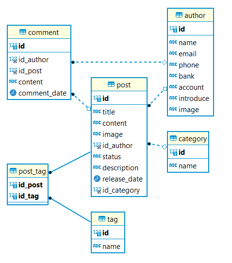

### Tạo bảng tag
```SQL
CREATE TABLE tag(
	id INT PRIMARY KEY AUTO_INCREMENT,
	name TEXT NOT NULL
)
```

### Tạo bảng category
```SQL
CREATE TABLE category(
	id INT PRIMARY KEY AUTO_INCREMENT,
	name TEXT NOT NULL
)
```

### Tạo bảng author
```SQL
CREATE TABLE author(
	id INT PRIMARY KEY AUTO_INCREMENT,
	name TEXT NOT NULL,
	email TEXT,
	phone TEXT,
	bank TEXT, 
	account TEXT,
	introduce TEXT,
	image TEXT
)
```

### Tạo bảng post
```SQL
CREATE TABLE post(
	id INT PRIMARY KEY AUTO_INCREMENT,
	title TEXT NOT NULL,
	content TEXT,
	image TEXT,
	id_author INT,
	status ENUM('draft', 'public'),
	description TEXT,
	release_date DATE,
	id_category INT,
	FOREIGN KEY (id_category) REFERENCES category(id),
	FOREIGN KEY (id_author) REFERENCES author(id)
)
```

### Tạo bảng post_tag
```SQL
CREATE TABLE post_tag(
	id_post INT,
	id_tag INT,
	PRIMARY KEY(id_post, id_tag),
	FOREIGN KEY (id_post) REFERENCES post(id),
	FOREIGN KEY (id_tag) REFERENCES tag(id)
)
```

### Tạo bảng comment
```SQL
CREATE TABLE comment(
	id INT PRIMARY KEY AUTO_INCREMENT,
	id_author INT,
	id_post INT,
	content TEXT,
	comment_date DATE,
	FOREIGN KEY (id_author) REFERENCES author(id),
	FOREIGN KEY (id_post) REFERENCES post(id)
)
```


