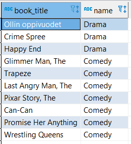
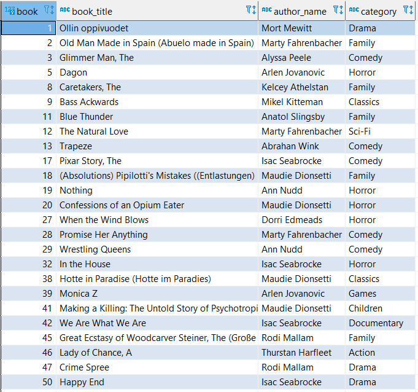
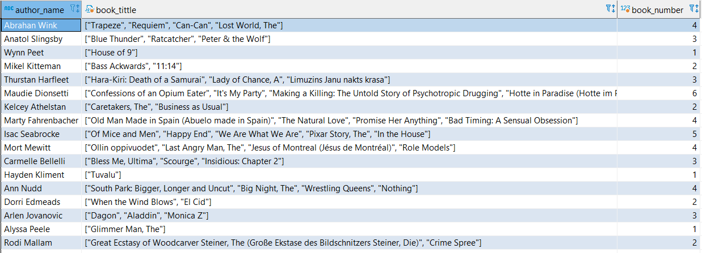

### 1. Lấy ra thông tin tất cả các quyển sách thuộc thể loại comedy hoặc drama
```sql
SELECT b.title AS book_title, c.name 
FROM book b INNER JOIN book_category bc 
ON b.id = bc.id_book 
INNER JOIN category c ON c.id =bc.id_category 
WHERE c.name LIKE 'Comedy' OR c.name = 'Drama'
```




### 2. Lấy ra id_book, title, author, category của quyển sách được xuất bản từ năm 1800 đến 1900
```sql
SELECT b.id AS book, b.title AS book_title, a.full_name AS author_name, c.name AS category
FROM book b INNER JOIN book_author ba 
ON b.id = ba.id_book 
INNER JOIN author a ON a.id = ba.id_author 
INNER JOIN book_category bc ON b.id  = bc.id_book 
INNER JOIN category c ON c.id = bc.id_category  
WHERE b.year_of_publication BETWEEN 1800 AND 1900
``` 



### 3. Đếm số sách dựa theo nhà xuất bản (Hiển thị tên nhà xuất bản và số sách thuộc nhà xuất bản đó)

```sql
SELECT a.full_name AS author_name, JSON_ARRAYAGG(b.title) AS book_tittle, COUNT(b.id) AS book_number
FROM author a INNER JOIN book_author ba 
ON a.id = ba.id_author 
INNER JOIN book b ON b.id = ba.id_book 
GROUP BY a.id 
```

